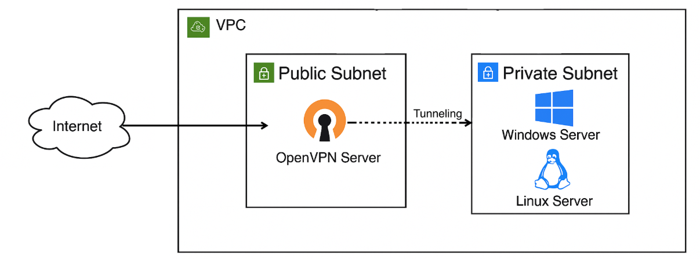

# Secure AWS Infrastructure: Threat Detection & Response

## Project Overview
This project demonstrates how to secure and monitor an AWS environment using native services. It covers infrastructure hardening, centralized logging, real-time threat detection, and automated response workflows.

To validate the setup, security events were simulated to demonstrate visibility, detection, and mitigation — supporting compliance goals aligned with **PCI DSS** and **GDPR**.

## Architecture Diagram

## Key Features
- Hardened EC2 instances with CIS-level security.
- Encrypted data at rest and in transit.
- Real-time logging via CloudTrail, CloudWatch, and VPC Flow Logs.
- Threat detection using GuardDuty.
- Automated remediation with Lambda and Network ACL rules.
- TTP simulation using Python (MITRE Discovery tactic).

## Documentation
- [Project Report](link-to-pdf)
- [Presentation Slides](https://docs.google.com/presentation/d/1c2HrOegtEJe4J82ZWXGPvTLqZriO6t3C/edit?usp=sharing&ouid=110327765505826154119&rtpof=true&sd=true)

## Repository Contents

| Component      | Description |
|----------------|-------------|
| [`/lambda`](./lambda)        | Lambda function that auto-blocks brute-force IPs and send an alert to the security team|
| [`/recon-scan`](./recon-scan) | Python script simulating internal network reconnaissance |

## Objective Breakdown

- **Hardened EC2 Instances**
  - CIS-compliant Windows Server Domain Controller (private subnet, accessible via VPN only)
  - CIS-compliant Linux Server hosting sensitive PII/PCI data with encrypted EBS volumes
  - Sysmon deployed on Windows for enhanced system logging

- **VPN Access**
  - OpenVPN configured on a public subnet for secure administrative access

- **Data Protection**
  - Encryption at rest using EBS
  - Encryption in transit via TLS/SSL

- **Monitoring and SIEM Integration**
  - AWS CloudWatch, VPC Flow Logs, and CloudTrail for log aggregation
  - GuardDuty for threat detection
  - EventBridge → Lambda → SNS workflow for alerting and auto-remediation

- **Threat Simulation**
  - Python script simulates network discovery from a compromised EC2
  - Mimics post-compromise attacker reconnaissance behavior
  - Uses `nmap` and `netifaces` to detect live hosts and open ports
  - Aligns with MITRE ATT&CK Tactic: **Discovery (T1046 - Network Service Discovery)**

- **Automated Threat Response**
  - SSH brute-force attacks detected by GuardDuty
  - EventBridge triggers a Lambda function
  - Lambda extracts attacker IP and blocks it via Network ACL (NACL)
  - SNS sends a real-time alert email to the security team

- **Compliance and Documentation**
  - Controls aligned with key PCI DSS and GDPR requirements:
    - Data encryption
    - Controlled access
    - Auditing and traceability
  - Security Incident Response Plan included
  - Demonstrates automated detection and mitigation within a compliant environment

---

## Team Contributors:

<table>
  <tr>
    <td align="center">
      <a href="https://github.com/roberta-vieira">
         
        Roberta Luz Vieira
      </a>
    </td>
  </tr>
</table>

<!-- 
---

## Attack Simulation (TTP)

- Python-based script simulates internal reconnaissance from a compromised EC2 instance
- Automatically identifies live hosts and open ports within internal subnets
- Triggers GuardDuty findings through legitimate reconnaissance behavior
- Demonstrates visibility of adversarial tactics in AWS

---

## Automated Threat Response

- GuardDuty detects an SSH brute-force attempt
- EventBridge rule triggers the `SendSecurityAlert-BruteForceAttack` Lambda function
- The Lambda function:
  - Extracts the attacker's IP address
  - Creates a `deny` rule in the Network ACL for port 22
  - Sends an SNS email alert with incident details

-->
